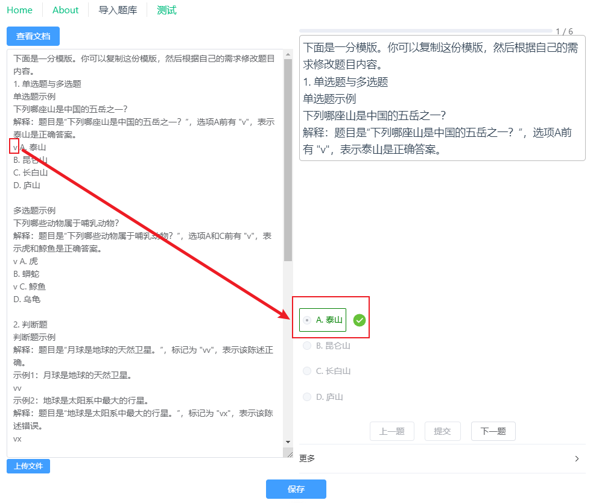
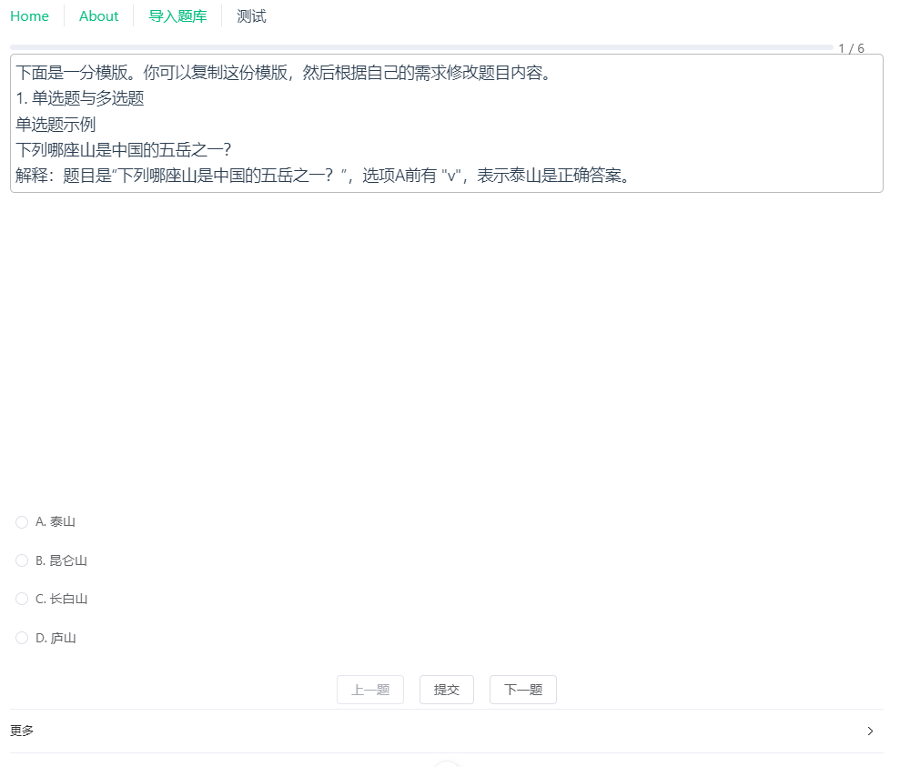

# 关于题库解析

## 功能介绍

本网站支持将文本格式的题库解析为结构化的题目数据，支持以下题型：

- 单选题
- 多选题
- 判断题
- 排序题
- 复合题目（包含多个小题）

## 使用方法

请按照以下规则编写题目文本：

### 1\. 单选题与多选题

使用 "A. " 或 "A) " 标记选项，正确选项前加 "v"。

```
下列哪座山是中国的五岳之一？
v A. 泰山
B. 昆仑山
C. 长白山
D. 庐山
```

解释：题目是“下列哪座山是中国的五岳之一？”，选项 A 前有 "v"，表示泰山是正确答案。

```
多选题示例
下列哪些动物属于哺乳动物？
v A. 虎
B. 蟒蛇
v C. 鲸鱼
D. 乌龟
```

解释：题目是“下列哪些动物属于哺乳动物？”，选项 A 和 C 前有 "v"，表示虎和鲸鱼是正确答案。

### 2\. 判断题

在题目后使用 "vv" 表示正确，"vx" 表示错误。

```
月球是地球的天然卫星。
vv
```

解释：题目是“地球是太阳系中最大的行星。”，标记为 "vx"，表示该陈述错误。

### 3\. 排序题

使用 "v1", "v2" 等标记正确顺序。

```
请将以下行星按离太阳的距离从近到远排序：
v2 A. 地球
v1 B. 水星
v3 C. 火星
```

解释：题目是“请将以下行星按离太阳的距离从近到远排序：”，标记为 "v1"、"v2"、"v3"，表示正确顺序是水星 -> 地球 -> 火星。

### 4\. 复合题目

使用 "x. " 标记每个小题，结束后空一行。

```
请完成以下题目：
x. 选出以下属于欧洲国家的选项：
v 法国
日本
v 意大利
巴西
x. 判断题：太平洋是世界上最大的海洋。
vv
x. 将以下发明按时间顺序排序：
v2 电灯
v1 轮子
v3 互联网

```

解释：

第一个小题：多选题，正确选项是法国和意大利。

第二个小题：判断题，标记为 "vv"，表示陈述正确。

第三个小题：排序题，正确顺序是轮子 -> 电灯 -> 互联网。

题目结束后有一个空行，表示与下一道题分隔。

注意事项

标记准确性：确保使用正确的标记（如 "v"、"vv"、"vx"、"v1" 等），否则可能导致解析错误。

选项清晰性：选项内容应简洁明了，避免歧义或重复。

复合题目分隔：包含多个小题的题目结束后务必空一行，避免与下一道题混淆。

灵活性：选项标记（如 "A. "）在复合题目情况下可以省略（也可以保留）。

希望本教程能帮助您顺利创建题库！如果有任何疑问，欢迎随时反馈。祝您使用愉快！

## 主要功能截图

- 从文本中提取题目、选项、正确选项。
  
- 点击提交后校验是否正确。
  
- 保存题目（只是保存到浏览器本地存储。）
  
- 选择保存的题库进行联系
  
  
- 提供了一些小工具
  

## 推荐的 IDE 设置

[VSCode](https://code.visualstudio.com/) + [Volar](https://marketplace.visualstudio.com/items?itemName=Vue.volar) (并禁用 Vetur).

## TypeScript 中对`.vue`导入的类型支持

TypeScript 默认无法处理`.vue`导入的类型信息，因此我们用`vue-tsc`替换`tsc`命令行工具来进行类型检查。在编辑器中，我们需要[Volar](https://marketplace.visualstudio.com/items?itemName=Vue.volar)来让 TypeScript 语言服务识别`.vue`类型。

## 自定义配置

查看 [Vite 配置参考](https://vite.dev/config/).

## 项目设置

```sh
pnpm install
```

### 编译和热重载用于开发

```sh
pnpm dev
```

### 类型检查、编译和压缩用于生产

```sh
pnpm build
```

### 使用[ESLint](https://eslint.org/)进行代码检查

```sh
pnpm lint
```
